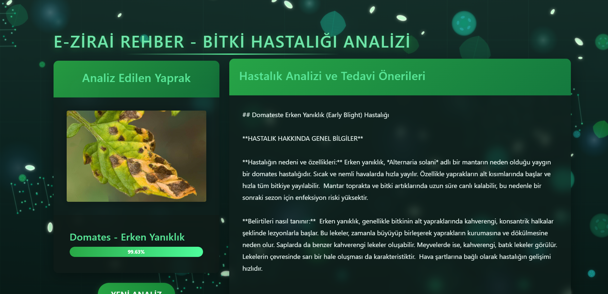

# AI Plant Disease Diagnosis 🌿🔬


## English

### Overview
AI Plant Disease Diagnosis is an advanced web application that combines computer vision and large language models (LLMs) to provide comprehensive plant disease detection and treatment guidance. This project demonstrates the powerful synergy between specialized AI models and generative AI to create practical solutions for agricultural challenges.

### 🤖 AI Technology Stack

**Vision Transformer (ViT) Model:**
- Trained on Kaggle's comprehensive plant disease dataset
- Utilizes Google's Vision Transformer architecture for superior image classification
- Capable of detecting multiple plant diseases across different crop types
- Achieves high accuracy in disease identification through advanced deep learning

**Large Language Model Integration:**
- **Gemini 1.5 Flash** provides intelligent, context-aware guidance
- Delivers detailed treatment recommendations in Turkish
- Offers preventive care strategies and organic treatment options
- Provides expert-level agricultural advice powered by AI

### 🎯 Key Features

- **Real-time Disease Detection**: Upload plant leaf images for instant AI-powered diagnosis
- **Multi-language Support**: Interface and AI responses in Turkish
- **Comprehensive Treatment Plans**: LLM-generated detailed treatment and prevention strategies
- **Caching System**: Optimized performance with intelligent response caching
- **User-friendly Interface**: Modern, responsive web design

### 🧠 The Power of AI in Agriculture

This project showcases how artificial intelligence is revolutionizing agriculture:

1. **Computer Vision Excellence**: Vision Transformers represent the cutting-edge of image recognition, surpassing traditional CNNs in accuracy and efficiency
2. **LLM-Powered Expertise**: Large language models democratize access to agricultural expertise, providing farmers with AI-powered consultation
3. **Seamless AI Integration**: Demonstrates how specialized AI models and generative AI can work together to solve real-world problems
4. **Scalable Solutions**: AI enables instant, 24/7 plant health consultations without geographic limitations

### 🚀 Technology Used

- **Frontend**: HTML5, CSS3, JavaScript
- **Backend**: Flask (Python)
- **AI Models**: 
  - Vision Transformer (ViT) for image classification
  - Google Gemini 1.5 Flash for intelligent text generation
- **Image Processing**: PIL, PyTorch
- **Model Framework**: Transformers (Hugging Face)

### 📋 Installation

1. **Clone the repository:**
   ```bash
   git clone https://github.com/yourusername/AI-Plant-Disease-Diagnosis.git
   cd AI-Plant-Disease-Diagnosis
   ```

2. **Create virtual environment:**
   ```bash
   python -m venv venv
   venv\Scripts\activate  # Windows
   ```

3. **Install dependencies:**
   ```bash
   pip install -r requirements.txt
   ```

4. **Set up Gemini API:**
   - Get your API key from [Google AI Studio](https://makersuite.google.com/app/apikey)
   - Update the API key in `gemini_helper.py`

5. **Run the application:**
   ```bash
   python app.py
   ```

6. **Access the application:**
   Open your browser and navigate to `http://127.0.0.1:5000`

### 🎯 Usage

1. Upload a clear image of a plant leaf
2. AI model analyzes the image using Vision Transformer technology
3. Receive instant disease detection results
4. Get comprehensive treatment guidance powered by Gemini LLM
5. Follow AI-recommended treatment and prevention strategies

### 🤝 Contributing

Contributions are welcome! This project demonstrates the potential of AI in agriculture, and we encourage improvements and extensions.

### 📄 License

This project is open source and available under the MIT License.

---

## Türkçe

### Genel Bakış
AI Bitki Hastalığı Teşhisi, bilgisayarlı görü ve büyük dil modellerini (LLM) birleştirerek kapsamlı bitki hastalığı tespiti ve tedavi rehberliği sunan gelişmiş bir web uygulamasıdır. Bu proje, özelleşmiş AI modelleri ile üretken yapay zeka arasındaki güçlü sinerjinin tarımsal zorluklar için pratik çözümler yaratma potansiyelini göstermektedir.

### 🤖 Yapay Zeka Teknoloji Yığını

**Vision Transformer (ViT) Modeli:**
- Kaggle'ın kapsamlı bitki hastalığı veri seti üzerinde eğitilmiştir
- Üstün görüntü sınıflandırması için Google'ın Vision Transformer mimarisini kullanır
- Farklı mahsul türlerinde çoklu bitki hastalıklarını tespit edebilir
- Gelişmiş derin öğrenme yoluyla hastalık tanımlamada yüksek doğruluk elde eder

**Büyük Dil Modeli Entegrasyonu:**
- **Gemini 1.5 Flash** akıllı, bağlam-farkında rehberlik sağlar
- Türkçe olarak detaylı tedavi önerileri sunar
- Koruyucu bakım stratejileri ve organik tedavi seçenekleri önerir
- AI destekli uzman seviyesinde tarımsal tavsiyeler verir

### 🎯 Temel Özellikler

- **Gerçek Zamanlı Hastalık Tespiti**: Anında AI destekli teşhis için bitki yaprağı resimleri yükleyin
- **Çok Dil Desteği**: Türkçe arayüz ve AI yanıtları
- **Kapsamlı Tedavi Planları**: LLM tarafından üretilen detaylı tedavi ve önleme stratejileri
- **Önbellekleme Sistemi**: Akıllı yanıt önbellekleme ile optimize edilmiş performans
- **Kullanıcı Dostu Arayüz**: Modern, duyarlı web tasarımı

### 🧠 Tarımda Yapay Zekanın Gücü

Bu proje, yapay zekanın tarımı nasıl devrimleştirdiğini göstermektedir:

1. **Bilgisayarlı Görü Mükemmelliği**: Vision Transformer'lar, geleneksel CNN'leri doğruluk ve verimlilik açısından geride bırakarak görüntü tanımanın en son teknolojisini temsil eder
2. **LLM Destekli Uzmanlık**: Büyük dil modelleri, çiftçilere AI destekli danışmanlık sağlayarak tarımsal uzmanlığa erişimi demokratikleştirir
3. **Sorunsuz AI Entegrasyonu**: Özelleşmiş AI modelleri ve üretken AI'nın gerçek dünya problemlerini çözmek için nasıl birlikte çalışabileceğini gösterir
4. **Ölçeklenebilir Çözümler**: AI, coğrafi sınırlamalar olmaksızın anlık, 7/24 bitki sağlığı danışmanlığı sağlar

### 🚀 Kullanılan Teknolojiler

- **Ön Yüz**: HTML5, CSS3, JavaScript
- **Arka Uç**: Flask (Python)
- **AI Modelleri**: 
  - Görüntü sınıflandırması için Vision Transformer (ViT)
  - Akıllı metin üretimi için Google Gemini 1.5 Flash
- **Görüntü İşleme**: PIL, PyTorch
- **Model Çerçevesi**: Transformers (Hugging Face)

### 📋 Kurulum

1. **Depoyu klonlayın:**
   ```bash
   git clone https://github.com/yourusername/AI-Plant-Disease-Diagnosis.git
   cd AI-Plant-Disease-Diagnosis
   ```

2. **Sanal ortam oluşturun:**
   ```bash
   python -m venv venv
   venv\Scripts\activate  # Windows
   ```

3. **Bağımlılıkları yükleyin:**
   ```bash
   pip install -r requirements.txt
   ```

4. **Gemini API'yi ayarlayın:**
   - [Google AI Studio](https://makersuite.google.com/app/apikey)'dan API anahtarınızı alın
   - `gemini_helper.py` dosyasındaki API anahtarını güncelleyin

5. **Uygulamayı çalıştırın:**
   ```bash
   python app.py
   ```

6. **Uygulamaya erişin:**
   Tarayıcınızı açın ve `http://127.0.0.1:5000` adresine gidin

### 🎯 Kullanım

1. Net bir bitki yaprağı resmi yükleyin
2. AI modeli Vision Transformer teknolojisini kullanarak görüntüyü analiz eder
3. Anında hastalık tespit sonuçları alın
4. Gemini LLM tarafından desteklenen kapsamlı tedavi rehberliği edinin
5. AI tarafından önerilen tedavi ve önleme stratejilerini takip edin

### 🤝 Katkıda Bulunma

Katkılar memnuniyetle karşılanır! Bu proje, tarımda AI'nın potansiyelini göstermektedir ve iyileştirmeleri ve genişletmeleri teşvik ediyoruz.

### 📄 Lisans

Bu proje açık kaynak kodludur ve MIT Lisansı altında mevcuttur.

---

## 🌟 Project Highlights / Proje Öne Çıkanları

- **AI-First Approach** / **AI Öncelikli Yaklaşım**: Leveraging state-of-the-art transformer models for agricultural solutions
- **LLM Integration** / **LLM Entegrasyonu**: Demonstrating practical applications of large language models in specialized domains
- **Real-world Impact** / **Gerçek Dünya Etkisi**: Addressing actual agricultural challenges with cutting-edge AI technology
- **Educational Value** / **Eğitim Değeri**: Showcasing the integration of computer vision and natural language processing

## 📸 Screenshots / Ekran Görüntüleri

### Home Page / Ana Sayfa

*Modern and user-friendly interface for plant disease detection / Bitki hastalığı tespiti için modern ve kullanıcı dostu arayüz*

### AI-Powered Treatment Guide / AI Destekli Tedavi Rehberi

*Comprehensive treatment recommendations powered by Gemini LLM / Gemini LLM tarafından desteklenen kapsamlı tedavi önerileri*

## 🔮 Future Enhancements / Gelecek Geliştirmeler

- Mobile application development
- Multi-language LLM support
- Advanced disease progression tracking
- Integration with IoT sensors
- Farmer community features

---

**Made with ❤️ and AI** / **❤️ ve AI ile yapılmıştır** 